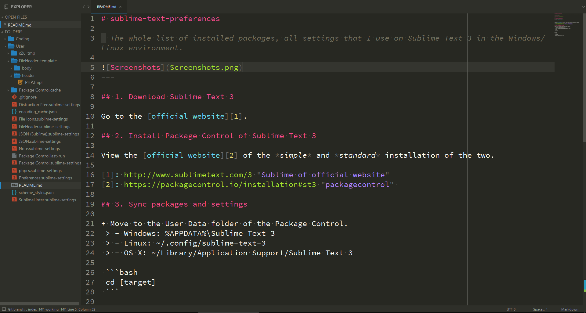

# sublime-text-preferences

> The whole list of installed packages, all settings that I use on Sublime Text 3 in the Windows/Linux environment.


---

## 1. Download Sublime Text 3

Go to the [official website][1].

## 2. Install Package Control of Sublime Text 3

View the [official website][2] of the *simple* and *standard* installation of the two.

[1]: http://www.sublimetext.com/3 "Sublime of official website"
[2]: https://packagecontrol.io/installation#st3 "packagecontrol" 

## 3. Sync packages and settings

+ Move to the User Data folder of the Package Control.
 > - Windows: %APPDATA%\Sublime Text 3
 > - Linux: ~/.config/sublime-text-3
 > - OS X: ~/Library/Application Support/Sublime Text 3

 ```bash
 cd [target] 
 ```

+ Move to the `Packages` folder, backup the `User` folder, and pull the new configuration data from git.

 ```bash
 cd Packages
 mv User User_old
 git clone [git repository] User
 ```
